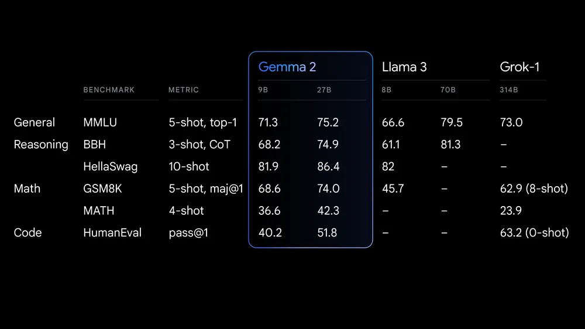

# Gemma 2

Google’s Gemma 2 model is available in three sizes, 2B, 9B and 27B, featuring a brand new architecture designed for class leading performance and efficiency.

## Class leading performance

At 27 billion parameters, Gemma 2 delivers performance surpassing models more than twice its size in benchmarks. This breakthrough efficiency sets a new standard in the open model landscape.

To run 9B Parameters: `ollama run gemma2`

## Benchmarks

## Intended Usage

Open Large Language Models (LLMs) have a wide range of applications across
various industries and domains. The following list of potential uses is not
comprehensive. The purpose of this list is to provide contextual information
about the possible use-cases that the model creators considered as part of model
training and development.

### Content Creation and Communication

* Text Generation: These models can be used to generate creative text formats such as poems, scripts, code marketing copy, and email drafts.
* Chatbots and Conversational AI: Power conversational interfaces for customer
service, virtual assistants, or interactive applications.
* Text Summarization: Generate concise summaries of a text corpus, research
papers, or reports.

### Research and Education

* Natural Language Processing (NLP) Research: These models can serve as a foundation for researchers to experiment with NLP techniques, develop algorithms, and contribute to the advancement of the field.
* Language Learning Tools: Support interactive language learning experiences, aiding in grammar correction or providing writing practice.
* Knowledge Exploration: Assist researchers in exploring large bodies of text by generating summaries or answering questions about specific topics.

## Using Gemma 2 with popular tooling

### LangChain

`from langchain_community.llms import Ollama
llm = Ollama(model="gemma2")
llm.invoke("Why is the sky blue?")`

### LlamaIndex

`from llama_index.llms.ollama import Ollama
llm = Ollama(model="gemma2")
llm.complete("Why is the sky blue?")`
